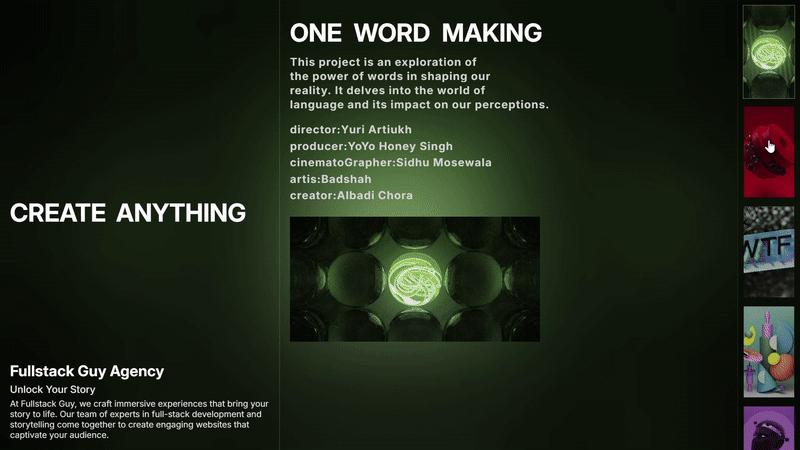

# Modern Smooth Gallery 🚀

A modern, interactive gallery website showcasing smooth animations and seamless user experience.

<!-- GitHub doesn't support video playback directly in README.md files. For video demonstration, please:
1. Download and view the video file locally at ./public/video/project.mp4
2. Or check the deployed version of the website
-->

# 💻 Tech Stack:
    

## About
This is a solo project featuring a modern gallery implementation with smooth animations and transitions. Built from scratch using powerful animation libraries like GSAP for fluid motion and Lenis for butter-smooth scrolling. The project demonstrates the seamless integration of modern web technologies to create an engaging user experience. 🚀
